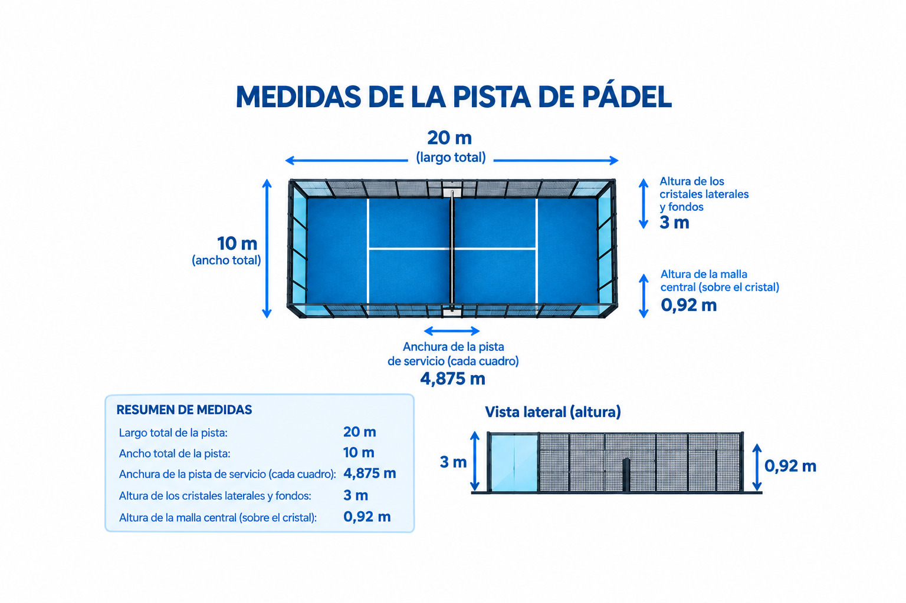

<!DOCTYPE html>
<html lang="es">
  <head>
	<meta charset="utf-8">
    <title>Página web del pádel</title>
	<link rel="icon" href="pelota-padel.png">
  </head>
  <body>
    <h1>Cosas básicas del pádel</h1>
	<h2>MEDIDAS DE LA PISTA DE PÁDEL</h2>
	  
Una pista de pádel reglamentaria mide 20 metros de largo por 10 metros de ancho, sumando un total de 200 metros cuadrados.

	<h3> Dimensiones principales:</h3>
      
·Área de juego: Rectángulo de 20 m de largo y 10 m de ancho (20 m x 6 m para pistas individuales).
 
      
·Red: Mide 10 metros de largo, con una altura de 88 cm en el centro y un máximo de 92 cm en los extremos.

      
·Líneas de servicio: Están situadas a 6,95 metros de distancia de la red.

      
·Grosor de las líneas: Todas las líneas de la pista tienen un ancho de 5 cm.Alturas de paredes y cerramientos.

      
·Paredes de fondo: Tienen una altura total de 4 metros (3 metros de pared —de vidrio u hormigón— más 1 metro de malla metálica superior).

	  
·Laterales: Combinan tramos de vidrio y malla; los vidrios suelen medir 3 metros de altura, y las rejas varían entre 3 y 4 metros según el diseño del fondo.
 
      
·Altura libre (techo): Se requiere un mínimo de 6 metros libres sin obstáculos (se recomiendan 8 metros para instalaciones nuevas).

	  
  </body>	  
</html> 
